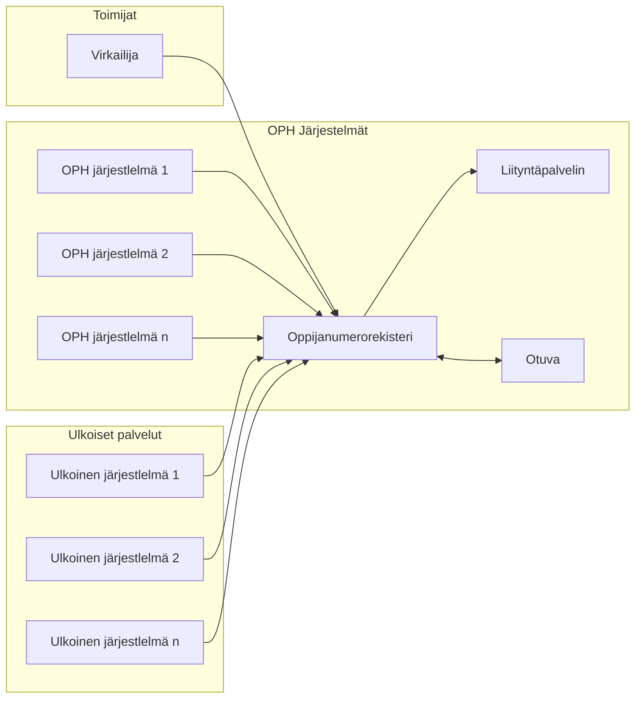

# Integraatiot

```mermaid


flowchart LR
    subgraph Toimijat
        Virkailija
    end
    subgraph OPH Järjestelmät
        Oppijanumerorekisteri
        Liityntäpalvelin
        Otuva
        muut_jarjestelmat_1[OPH järjestlelmä 1]
        muut_jarjestelmat_2[OPH järjestlelmä 2]
        muut_jarjestelmat_n[OPH järjestlelmä n]
    end
    subgraph Ulkoiset palvelut
        ulkoiset_jarjestelmat_1[Ulkoinen järjestlelmä 1]
        ulkoiset_jarjestelmat_2[Ulkoinen järjestlelmä 2]
        ulkoiset_jarjestelmat_n[Ulkoinen järjestlelmä n]
    end
    Virkailija --> Oppijanumerorekisteri 
    Oppijanumerorekisteri <--> Otuva
    Oppijanumerorekisteri --> Liityntäpalvelin
    muut_jarjestelmat_1 --> Oppijanumerorekisteri
    muut_jarjestelmat_2 --> Oppijanumerorekisteri
    muut_jarjestelmat_n --> Oppijanumerorekisteri
    ulkoiset_jarjestelmat_1 --> Oppijanumerorekisteri
    ulkoiset_jarjestelmat_2 --> Oppijanumerorekisteri
    ulkoiset_jarjestelmat_n --> Oppijanumerorekisteri
```