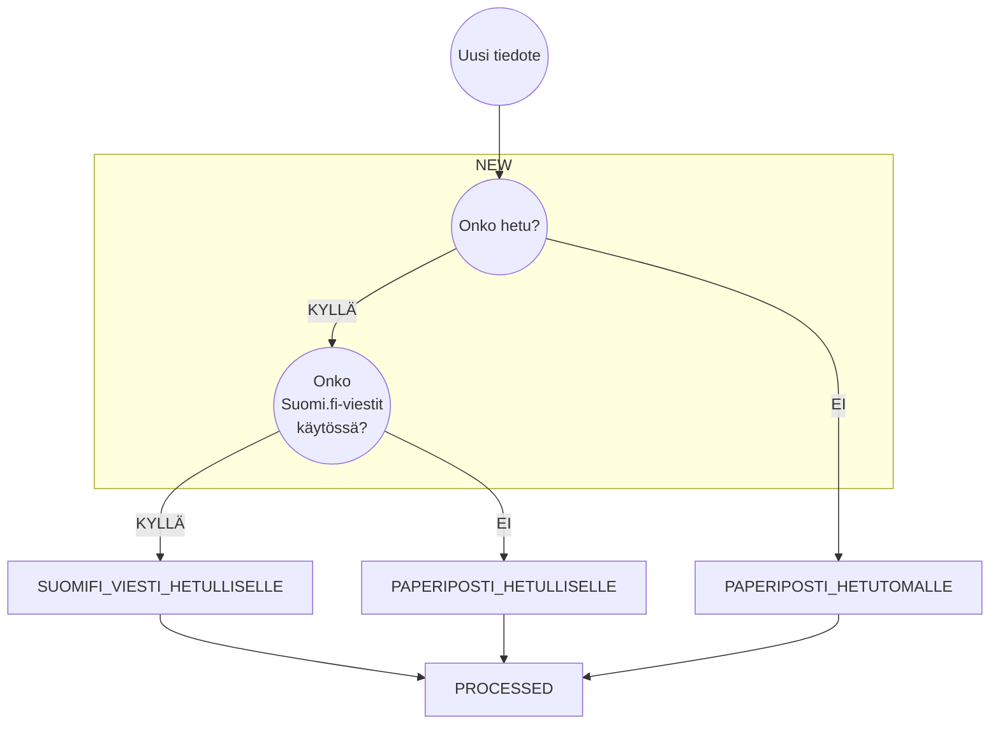

## Tilojen kuvauksia

Uusi tiedote
```json
{
  "meta": { "type": "KIELITUTKINTOTODISTUS", "state": "NEW" },
  "statuses": [
    {"status": "CREATED", "timestamp": "2024-06-01T12:00:00Z"}
  ]
}
```

### Suomi.fi-viestit käytössä

Käsittelyssä
```json
{
  "meta": { "type": "KIELITUTKINTOTODISTUS", "state": "SUOMIFI_VIESTI_HETULLISELLE" },
  "statuses": [
    {"status": "CREATED", "timestamp": "2024-06-01T12:00:00Z"}
  ]
}
```
Viesti lähetetty onnistuneesti
```json
{
  "meta": { "type": "KIELITUTKINTOTODISTUS", "state": "PROCESSED" },
  "statuses": [
    {"status": "CREATED", "timestamp": "2024-06-01T12:00:00Z"},
    {"status": "SENT_TO_SUOMIFI_VIESTIT", "timestamp": "2024-06-02T12:00:00Z"}
  ]
}
```
Tilatieto "Receipt confirmed" saatu Suomi.filtä
```json
{
  "meta": { "type": "KIELITUTKINTOTODISTUS", "state": "PROCESSED" },
  "statuses": [
    {"status": "CREATED", "timestamp": "2024-06-01T12:00:00Z"},
    {"status": "SENT_TO_SUOMIFI_VIESTIT", "timestamp": "2024-06-02T12:00:00Z"},
    {"status": "SUOMIFI_VIESTI_OPENED", "timestamp": "2024-06-04T18:00:00Z"}
  ]
}
```

### Ei Suomi.fi-viestejä käytössä

Käsittelyssä
```json
{
  "meta": { "type": "KIELITUTKINTOTODISTUS", "state": "PAPERIPOSTI_HETULLISELLE" },
  "statuses": [
    {"status": "CREATED", "timestamp": "2024-06-01T12:00:00Z"}
  ]
}
```
Viesti lähetetty onnistuneesti
```json
{
  "meta": { "type": "KIELITUTKINTOTODISTUS", "state": "PROCESSED" },
  "statuses": [
    {"status": "CREATED", "timestamp": "2024-06-01T12:00:00Z"},
    {"status": "SENT_FOR_PAPER_MAILING", "timestamp": "2024-06-02T12:00:00Z"}
  ]
}
```
Tilatieto "Sent for printing and enveloping" saatu Suomi.filtä
```json
{
  "meta": { "type": "KIELITUTKINTOTODISTUS", "state": "PROCESSED" },
  "statuses": [
    {"status": "CREATED", "timestamp": "2024-06-01T12:00:00Z"},
    {"status": "SENT_FOR_PAPER_MAILING", "timestamp": "2024-06-02T12:00:00Z"},
    {"status": "SENT_FOR_PRINTING_AND_ENVELOPING", "timestamp": "2024-06-04T12:00:00Z"}
  ]
}
```


### Hetuton

Käsittelyssä
```json
{
  "meta": { "type": "KIELITUTKINTOTODISTUS", "state": "PAPERIPOSTI_HETUTOMALLE" },
  "statuses": [
    {"status": "CREATED", "timestamp": "2024-06-01T12:00:00Z"}
  ]
}
```
Viesti lähetetty onnistuneesti
```json
{
  "meta": { "type": "KIELITUTKINTOTODISTUS", "state": "PROCESSED" },
  "statuses": [
    {"status": "CREATED", "timestamp": "2024-06-01T12:00:00Z"},
    {"status": "SENT_FOR_PAPER_MAILING", "timestamp": "2024-06-02T12:00:00Z"}
  ]
}
```
Tilatieto "Sent for printing and enveloping" saatu Suomi.filtä
```json
{
  "meta": { "type": "KIELITUTKINTOTODISTUS", "state": "PROCESSED" },
  "statuses": [
    {"status": "CREATED", "timestamp": "2024-06-01T12:00:00Z"},
    {"status": "SENT_FOR_PAPER_MAILING", "timestamp": "2024-06-02T12:00:00Z"},
    {"status": "SENT_FOR_PRINTING_AND_ENVELOPING", "timestamp": "2024-06-04T12:00:00Z"}
  ]
}

